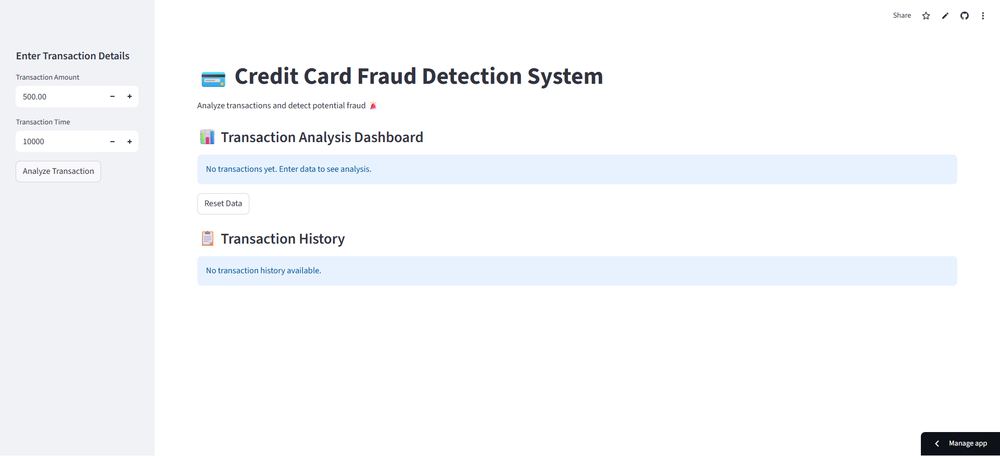
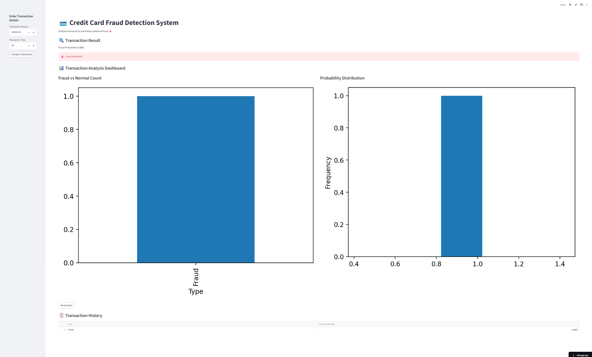
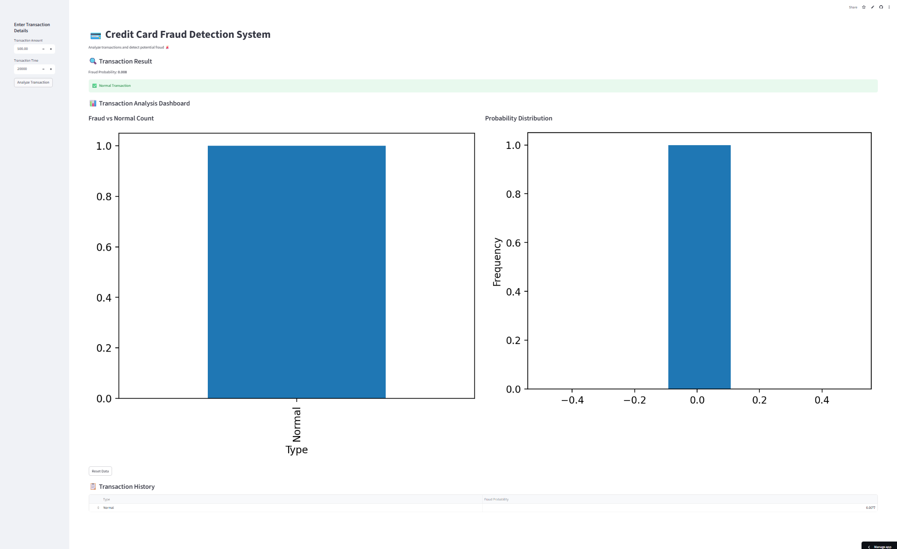
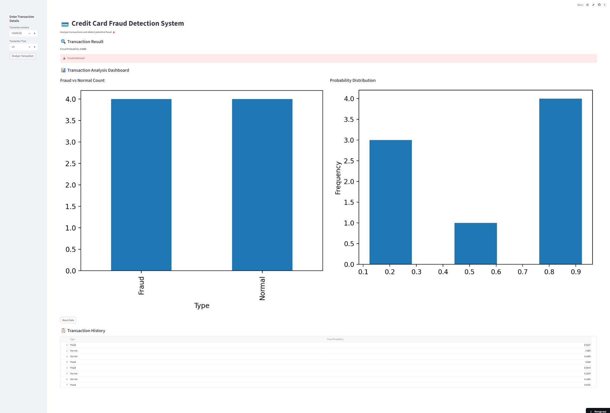

# 🚀 Credit Card Fraud Detection System

## 📌 Overview
This project is a **Machine Learning-based Credit Card Fraud Detection System** that identifies whether a transaction is **fraudulent or genuine**.

It simulates a real-world **banking fraud detection pipeline** with preprocessing, imbalance handling, model training, and an interactive dashboard.

---

## 🎯 Problem Statement
Credit card fraud is a major issue in digital payments, causing huge financial losses and affecting customer trust.

### Challenges:
- Extremely **imbalanced dataset** (fraud < 1%)
- Need for **real-time detection**
- Minimizing **false positives**

---

## 💡 Solution
This project uses:

- ✔ Random Forest Classifier  
- ✔ SMOTE (to handle imbalanced data)  
- ✔ Feature scaling  
- ✔ Real-time fraud prediction  
- ✔ Interactive Streamlit dashboard  

---

## 🧠 Key Features
- 🔍 Fraud detection using Machine Learning  
- ⚖️ Handles imbalanced dataset using SMOTE  
- 📊 Interactive charts and analytics  
- 🚨 Real-time fraud alert system  
- 📋 Transaction history tracking  
- 💻 Clean UI using Streamlit  

---

## 🏗️ Project Architecture
┌──────────────────────┐
        │   Transaction Data   │
        │ (Amount, Time, V1–V28)
        └──────────┬───────────┘
                   ↓
        ┌──────────────────────┐
        │  Data Preprocessing  │
        │  - Cleaning          │
        │  - Scaling           │
        └──────────┬───────────┘
                   ↓
        ┌──────────────────────┐
        │ Imbalance Handling   │
        │       (SMOTE)        │
        └──────────┬───────────┘
                   ↓
        ┌──────────────────────┐
        │   Model Training     │
        │   Random Forest      │
        └──────────┬───────────┘
                   ↓
        ┌──────────────────────┐
        │  Model Evaluation    │
        │ Precision / Recall   │
        └──────────┬───────────┘
                   ↓
        ┌──────────────────────┐
        │  Fraud Prediction    │
        │  (0 = Normal, 1 = Fraud)
        └──────────┬───────────┘
                   ↓
        ┌──────────────────────┐
        │   Alert System       │
        │ 🚨 Fraud / ✅ Normal  │
        └──────────┬───────────┘
                   ↓
        ┌──────────────────────┐
        │  Streamlit Dashboard │
        │ Charts + History     │
        └──────────────────────┘

---

## 🛠️ Tech Stack

- Python  
- Pandas, NumPy  
- Scikit-learn  
- Imbalanced-learn (SMOTE)  
- Matplotlib, Seaborn  
- Streamlit  

---

## 📊 Model Details

- Algorithm: Random Forest Classifier  
- Problem Type: Binary Classification  

Target:
- 0 → Normal Transaction  
- 1 → Fraudulent Transaction  

---

## 📈 Evaluation Metrics

- Precision  
- Recall (Most Important)  
- F1 Score  
- Confusion Matrix  

> In fraud detection, recall is more important because missing a fraud is more costly than flagging a normal transaction.

---

## 📸 Screenshots

### Dashboard


### Fraud Detection


### Normal Transaction


### Analytics



---

## ▶️ How to Run the Project

### 1. Clone the Repository
```bash
git clone <https://github.com/needhi-x/Credit-Card-Fraud-Detect>
cd Credit-Card-Fraud-Detection
```
2. Install Dependencies
```
pip install -r requirements.txt
```
3. Run Model Script
```
python main.py
```
4. Run Streamlit App
```
streamlit run app.py
```
---

## 📁 Project StructureCredit-Card-Fraud-Detection/
│
├── data/
├── models/
├── outputs/
├── images/
├── app.py
├── main.py
├── requirements.txt
└── README.md

---
## 🚀 Future Improvements
- Real-time API integration
- Cloud deployment (AWS / Streamlit Cloud)
- Advanced models (XGBoost, Deep Learning)
- Persistent database storage

---
## 💼 Resume Highlights
- Built an end-to-end fraud detection ML pipeline
- Handled imbalanced data using SMOTE
- Developed an interactive dashboard using Streamlit
- Focused on recall-based evaluation for fraud detection

---

## 🧠 Key Learnings
- Handling imbalanced datasets
- Importance of recall in fraud detection
- Trade-off between precision & recall
- Feature scaling and preprocessing
- Real-world ML pipeline design

---
## 👩‍💻 Author

**Nidhi**

- GitHub: https://github.com/<needhi-x>  
  

---

⭐ If you like this project, give it a star!
